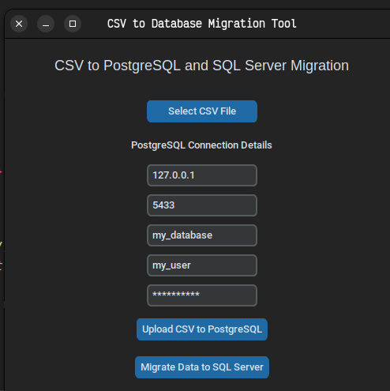
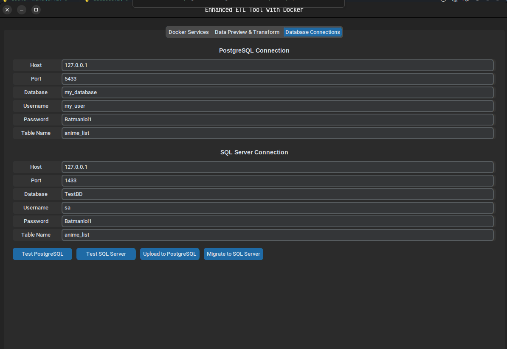

# Herramienta de Migración de CSV a Base de Datos

## Descripción
Esta herramienta de interfaz gráfica de usuario (GUI) basada en Python, construida usando `customTkinter`, permite a los usuarios:

1. Seleccionar un archivo CSV y cargar su contenido en una base de datos PostgreSQL.
2. Migrar datos de PostgreSQL a una base de datos SQL Server.

## Características
- GUI simple y fácil de usar.
- Manejo seguro de credenciales de PostgreSQL y SQL Server.
- Muestra mensajes de éxito o error durante cada operación.

## Requisitos Previos
Asegúrese de que el siguiente software y paquetes estén instalados:

- **Python 3.x**
- **Docker**
- PostgreSQL y SQL Server ejecutándose en contenedores Docker.
- Paquetes de Python requeridos:
    ```bash
    pip install pandas sqlalchemy psycopg2-binary pymssql customtkinter
    ```

## Instrucciones de Uso

### 1. Iniciar Contenedores de PostgreSQL y SQL Server

Ejecute contenedores Docker para PostgreSQL y SQL Server con los puertos y credenciales apropiados.

Comandos de ejemplo:
```bash
# Iniciar contenedor de PostgreSQL
sudo docker run --name postgres-container -e POSTGRES_USER=my_user -e POSTGRES_PASSWORD=<someone> -p 5433:5432 -d postgres

# Iniciar contenedor de SQL Server
sudo docker run --name sqlserver-container -e "ACCEPT_EULA=Y" -e "SA_PASSWORD=<someone> " -p 1433:1433 -d mcr.microsoft.com/mssql/server
```

### 2. Ejecutar la Aplicación

Ejecute el script con:
```bash
python dataMigration.py
```

### 3. Seleccionar Archivo CSV

Haga clic en el botón **Seleccionar Archivo CSV** y elija un archivo CSV para migrar.

### 4. Ingresar Credenciales de PostgreSQL
Los valores predeterminados están prellenados pero pueden ser modificados si es necesario.

### 5. Cargar CSV a PostgreSQL
Haga clic en el botón **Cargar CSV a PostgreSQL**.

### 6. Migrar Datos a SQL Server
Haga clic en el botón **Migrar Datos a SQL Server** para copiar los datos de PostgreSQL a SQL Server.

## Detalles de Conexión Predeterminados

- **PostgreSQL:**
    - Host: `127.0.0.1`
    - Puerto: `5433`
    - Base de datos: `my_database`
    - Usuario: `my_user`
    - Contraseña: `<someone>`

- **SQL Server:**
    - Host: `127.0.0.1`
    - Puerto: `1433`
    - Usuario: `sa`
    - Contraseña: `<someone> `

## Capturas de Pantalla

### GUI


### Evidencia de Csv a PostgreSQL


### Evidencia de PostgreSQL a SQL Server


## Solución de Problemas
1. **Error de `tkinter` Faltante:**
     ```bash
     sudo apt-get install python3-tk
     ```
2. **Fallo de Migración Debido a Error de Módulo:**
     Asegúrese de que `pymssql` esté instalado:
     ```bash
     pip install pymssql
     ```

## Licencia
Este proyecto está licenciado bajo la Licencia MIT.

## Autor
[Su Nombre]
