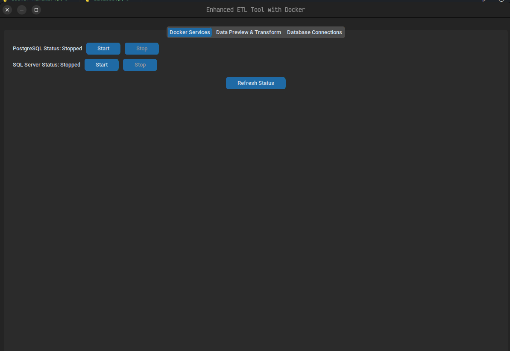

# **Herramienta ETL Mejorada con Docker**

## Descripción
Esta aplicación de escritorio está diseñada para facilitar el proceso de migración de datos entre archivos CSV y bases de datos, incluyendo PostgreSQL y SQL Server, utilizando Docker para gestionar los servicios. La herramienta permite realizar operaciones comunes de ETL (Extract, Transform, Load) con una interfaz gráfica intuitiva construida con `customTkinter`.

### Evidencias graficas



## Características
- **Integración con Docker:** Gestiona contenedores de PostgreSQL y SQL Server directamente desde la interfaz.
- **Visualización y Transformación de Datos:** Permite cargar y visualizar archivos CSV, seleccionar y modificar columnas, y realizar transformaciones básicas como eliminar duplicados o llenar valores nulos.
- **Conexión a Bases de Datos:** Configura y prueba conexiones a PostgreSQL y SQL Server.
- **Migración de Datos:** Permite cargar los datos transformados a las bases de datos directamente desde la interfaz.

## Requisitos
Para usar esta aplicación, necesitarás:
- **Python 3.7+**
- **Docker**: Para ejecutar contenedores de bases de datos.
- **Dependencias de Python**: 
  - `customtkinter`
  - `pandas`
  - `sqlalchemy`
  - `docker`
  - `tkinter`
  
Puedes instalar las dependencias necesarias ejecutando el siguiente comando:
```bash
pip install customtkinter pandas sqlalchemy docker tkinter
```

## Instalación y Uso

1. **Configuración de Docker:**
   - Asegúrate de tener Docker instalado y funcionando en tu máquina.
   - La aplicación gestionará los contenedores de PostgreSQL y SQL Server mediante archivos `docker-compose`. Si no tienes estos archivos, se mostrarán errores indicando que falta el archivo de configuración de Docker.

2. **Ejecutar la Aplicación:**
   - Descarga o clona este repositorio.
   - Ejecuta el archivo `gui.py`:
   ```bash
   python gui.py
   ```

3. **Interfaz de Usuario:**
   La aplicación se abrirá en una ventana de escritorio con las siguientes pestañas:
   - **Servicios Docker:** Controla los servicios de Docker (PostgreSQL y SQL Server), permitiendo iniciarlos o detenerlos.
   - **Vista Previa y Transformación de Datos:** Carga archivos CSV, visualiza sus contenidos, selecciona columnas y aplica transformaciones.
   - **Conexiones a Bases de Datos:** Configura y prueba las conexiones a PostgreSQL y SQL Server, y migra los datos transformados a estas bases.

4. **Manejo de Archivos CSV:**
   - Selecciona un archivo CSV desde la interfaz.
   - Visualiza y edita las columnas del archivo.
   - Aplica transformaciones como eliminar duplicados, llenar valores nulos, etc.
   - Una vez que los datos estén listos, puedes migrarlos a PostgreSQL o SQL Server.

5. **Conexión y Migración de Datos:**
   - Configura las conexiones a tus bases de datos en la pestaña correspondiente.
   - Usa los botones de prueba para verificar la conexión.
   - Sube los datos transformados a las bases de datos.

## Funcionalidades Detalladas

### Docker
- **Iniciar/Detener Contenedores Docker:** Controla el estado de los contenedores de PostgreSQL y SQL Server.
- **Verificar Estado:** Muestra el estado de los contenedores (en ejecución o detenidos).

### Vista Previa de Datos
- **Cargar CSV:** Selecciona un archivo CSV para cargarlo en la aplicación.
- **Modificar Datos:** Realiza transformaciones como:
  - **Seleccionar columnas**: Escoge las columnas que quieres conservar.
  - **Eliminar columnas**: Elimina columnas innecesarias.
  - **Llenar valores nulos**: Rellena los valores nulos con cero.
  - **Eliminar duplicados**: Elimina filas duplicadas del archivo.
  
### Conexiones a Bases de Datos
- **Configuración de conexión:** Configura los parámetros de conexión a las bases de datos PostgreSQL y SQL Server.
- **Probar conexión:** Verifica que las conexiones a las bases de datos funcionen correctamente.
- **Migrar datos:** Sube los datos transformados a las bases de datos seleccionadas.

## Contribución
Si deseas contribuir a este proyecto, siéntete libre de hacer un fork y enviar pull requests. Asegúrate de que tu código esté bien probado y documentado.

## Licencia
Este proyecto está bajo la licencia MIT. Para más detalles, consulta el archivo `LICENSE`.

---
